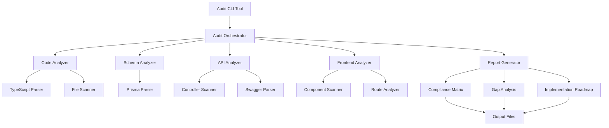

# PRD Compliance Audit - Design Document

## Overview

The PRD Compliance Audit feature provides a systematic, automated approach to verify that all Product Requirements Document (PRD) and Technical Requirements Document (TRD) specifications are implemented in the NivixPe freelancer platform codebase. This audit system will analyze the existing implementation across 14 major functional areas, generate compliance matrices, identify gaps, and produce actionable roadmaps for completing missing features.

### Purpose

The audit system serves three primary purposes:

1. **Verification**: Systematically verify that all PRD requirements are implemented in the codebase
2. **Gap Analysis**: Identify missing, partially implemented, or incorrectly implemented features
3. **Roadmap Generation**: Produce prioritized, actionable plans for completing missing functionality

### Scope

The audit covers:
- 14 major functional areas (User Roles, Authentication, Projects, Bidding, Payments, Messaging, Reviews, Disputes, Admin, Architecture, Database, API, Frontend, Non-Functional Requirements)
- Backend services (NestJS microservices)
- Frontend applications (Next.js web, React Native mobile, Admin dashboard)
- Database schema (Prisma)
- API design (REST endpoints, OpenAPI documentation)
- Infrastructure and architecture patterns

### Key Features

1. **Automated Code Analysis**: Static analysis of TypeScript/JavaScript code to detect implemented features
2. **Schema Validation**: Prisma schema analysis to verify database entities and relationships
3. **API Endpoint Discovery**: Automatic detection of REST endpoints and their capabilities
4. **Compliance Matrix Generation**: Structured output showing implementation status for each requirement
5. **Gap Analysis Reports**: Detailed reports of missing or incomplete features
6. **Implementation Roadmap**: Prioritized list of work items with effort estimates

## Architecture

### System Components



### Architecture Patterns

1. **Modular Analyzer Design**: Each analyzer is responsible for a specific aspect of the codebase (code, schema, API, frontend)
2. **Plugin Architecture**: Analyzers can be extended or replaced without affecting the core orchestrator
3. **Rule-Based Validation**: Each PRD requirement is mapped to validation rules that analyzers execute
4. **Incremental Analysis**: Analyzers can cache results and perform incremental updates
5. **Report Aggregation**: The orchestrator collects results from all analyzers and generates unified reports

### Technology Stack

- **Language**: TypeScript (Node.js)
- **Parsing**: TypeScript Compiler API, @prisma/internals
- **CLI Framework**: Commander.js or Yargs
- **Reporting**: Markdown generation, JSON output, HTML reports (optional)
- **Testing**: Jest for unit tests, property-based testing for validation logic

## Components and Interfaces

### 1. Audit Orchestrator

**Responsibility**: Coordinates the execution of all analyzers and aggregates results.

```typescript
interface AuditOrchestrator {
  /**
   * Execute the complete audit process
   */
  runAudit(config: AuditConfig): Promise<AuditResult>;
  
  /**
   * Run specific analyzers only
   */
  runPartialAudit(analyzers: AnalyzerType[], config: AuditConfig): Promise<PartialAuditResult>;
  
  /**
   * Generate reports from audit results
   */
  generateReports(result: AuditResult, outputDir: string): Promise<void>;
}

interface AuditConfig {
  rootDir: string;
  backendDir: string;
  frontendDirs: {
    web: string;
    mobile: string;
    admin: string;
  };
  prismaSchemaPath: string;
  requirementsPath: string;
  outputDir: string;
  verbose: boolean;
  cacheEnabled: boolean;
}

interface AuditResult {
  timestamp: Date;
  summary: AuditSummary;
  moduleResults: ModuleAuditResult[];
  complianceMatrix: ComplianceMatrix;
  gaps: Gap[];
  recommendations: Recommendation[];
}
```

### 2. Code Analyzer

**Responsibility**: Analyzes TypeScript/JavaScript source code to detect implemented features.

```typescript
interface CodeAnalyzer {
  /**
   * Analyze a module's implementation
   */
  analyzeModule(modulePath: string, requirements: Requirement[]): Promise<ModuleAnalysisResult>;
  
  /**
   * Detect implemented controllers and services
   */
  discoverServices(modulePath: string): Promise<ServiceDiscovery>;
  
  /**
   * Analyze authentication implementation
   */
  analyzeAuthentication(authModulePath: string): Promise<AuthenticationAnalysis>;
  
  /**
   * Analyze RBAC implementation
   */
  analyzeRBAC(modulePath: string): Promise<RBACAnalysis>;
}

interface ModuleAnalysisResult {
  moduleName: string;
  filesAnalyzed: number;
  servicesFound: string[];
  controllersFound: string[];
  guardsFound: string[];
  implementedFeatures: FeatureImplementation[];
  missingFeatures: string[];
  partialFeatures: PartialFeature[];
}

interface FeatureImplementation {
  requirementId: string;
  status: 'FULLY_IMPLEMENTED' | 'PARTIALLY_IMPLEMENTED' | 'NOT_IMPLEMENTED';
  confidence: number; // 0-100
  evidence: Evidence[];
  notes: string[];
}

interface Evidence {
  type: 'FILE' | 'FUNCTION' | 'CLASS' | 'DECORATOR' | 'ENDPOINT';
  location: string;
  snippet: string;
}
```

### 3. Schema Analyzer

**Responsibility**: Validates Prisma schema against database requirements.

```typescript
interface SchemaAnalyzer {
  /**
   * Analyze Prisma schema completeness
   */
  analyzeSchema(schemaPath: string, requirements: DatabaseRequirement[]): Promise<SchemaAnalysisResult>;
  
  /**
   * Validate required tables exist
   */
  validateTables(schema: PrismaSchema, requiredTables: string[]): TableValidationResult;
  
  /**
   * Validate table fields and relationships
   */
  validateTableStructure(schema: PrismaSchema, tableRequirements: TableRequirement[]): StructureValidationResult;
  
  /**
   * Check for missing indexes
   */
  validateIndexes(schema: PrismaSchema): IndexValidationResult;
}

interface SchemaAnalysisResult {
  tablesFound: number;
  tablesRequired: number;
  missingTables: string[];
  incompleteTable: IncompleteTable[];
  missingFields: MissingField[];
  missingRelationships: MissingRelationship[];
  missingIndexes: MissingIndex[];
  extraTables: string[];
}

interface IncompleteTable {
  tableName: string;
  missingFields: string[];
  missingRelationships: string[];
  issues: string[];
}
```

### 4. API Analyzer

**Responsibility**: Discovers and validates REST API endpoints.

```typescript
interface APIAnalyzer {
  /**
   * Discover all API endpoints
   */
  discoverEndpoints(controllersDir: string): Promise<EndpointDiscovery>;
  
  /**
   * Validate endpoint completeness against requirements
   */
  validateEndpoints(endpoints: Endpoint[], requirements: APIRequirement[]): EndpointValidationResult;
  
  /**
   * Analyze Swagger/OpenAPI documentation
   */
  analyzeAPIDocumentation(swaggerPath: string): APIDocumentationAnalysis;
  
  /**
   * Check authentication and authorization
   */
  analyzeEndpointSecurity(endpoints: Endpoint[]): SecurityAnalysis;
}

interface EndpointDiscovery {
  totalEndpoints: number;
  endpointsByModule: Map<string, Endpoint[]>;
  endpointsByMethod: Map<HttpMethod, Endpoint[]>;
  authenticatedEndpoints: number;
  publicEndpoints: number;
}

interface Endpoint {
  path: string;
  method: HttpMethod;
  controller: string;
  handler: string;
  guards: string[];
  roles: string[];
  documented: boolean;
  requestDto?: string;
  responseDto?: string;
}
```

### 5. Frontend Analyzer

**Responsibility**: Analyzes frontend applications for feature completeness.

```typescript
interface FrontendAnalyzer {
  /**
   * Analyze Next.js web application
   */
  analyzeWebApp(webAppDir: string, requirements: FrontendRequirement[]): Promise<WebAppAnalysis>;
  
  /**
   * Analyze React Native mobile app
   */
  analyzeMobileApp(mobileAppDir: string, requirements: FrontendRequirement[]): Promise<MobileAppAnalysis>;
  
  /**
   * Analyze admin dashboard
   */
  analyzeAdminApp(adminAppDir: string, requirements: AdminRequirement[]): Promise<AdminAppAnalysis>;
  
  /**
   * Discover routes and pages
   */
  discoverRoutes(appDir: string): Promise<RouteDiscovery>;
  
  /**
   * Analyze component usage
   */
  analyzeComponents(appDir: string): Promise<ComponentAnalysis>;
}

interface WebAppAnalysis {
  pagesFound: number;
  pagesRequired: number;
  missingPages: string[];
  componentsFound: number;
  routesImplemented: Route[];
  missingRoutes: string[];
  authenticationIntegrated: boolean;
  apiIntegrationComplete: boolean;
}
```

### 6. Report Generator

**Responsibility**: Generates compliance reports in multiple formats.

```typescript
interface ReportGenerator {
  /**
   * Generate compliance matrix
   */
  generateComplianceMatrix(result: AuditResult): ComplianceMatrix;
  
  /**
   * Generate gap analysis report
   */
  generateGapAnalysis(result: AuditResult): GapAnalysisReport;
  
  /**
   * Generate implementation roadmap
   */
  generateRoadmap(gaps: Gap[], priorities: Priority[]): ImplementationRoadmap;
  
  /**
   * Export reports to files
   */
  exportReports(reports: Reports, outputDir: string, formats: ReportFormat[]): Promise<void>;
}

interface ComplianceMatrix {
  categories: ComplianceCategory[];
  overallScore: number;
  fullyImplemented: number;
  partiallyImplemented: number;
  notImplemented: number;
}

interface ComplianceCategory {
  name: string;
  requirements: RequirementStatus[];
  score: number;
  status: 'COMPLETE' | 'PARTIAL' | 'INCOMPLETE';
}

interface RequirementStatus {
  id: string;
  description: string;
  status: '✅' | '⚠️' | '❌';
  implementationDetails: string;
  evidence: Evidence[];
  gaps: string[];
}
```

## Data Models

### Core Data Structures

```typescript
// Requirement representation
interface Requirement {
  id: string;
  category: RequirementCategory;
  title: string;
  description: string;
  acceptanceCriteria: AcceptanceCriterion[];
  priority: 'CRITICAL' | 'HIGH' | 'MEDIUM' | 'LOW';
  dependencies: string[];
}

interface AcceptanceCriterion {
  id: string;
  description: string;
  testable: boolean;
  validationRules: ValidationRule[];
}

interface ValidationRule {
  type: 'FILE_EXISTS' | 'CLASS_EXISTS' | 'METHOD_EXISTS' | 'ENDPOINT_EXISTS' | 'TABLE_EXISTS' | 'FIELD_EXISTS';
  target: string;
  parameters: Record<string, any>;
}

// Gap representation
interface Gap {
  requirementId: string;
  severity: 'CRITICAL' | 'HIGH' | 'MEDIUM' | 'LOW';
  type: 'MISSING' | 'PARTIAL' | 'INCORRECT';
  description: string;
  impact: string;
  recommendation: string;
  estimatedEffort: EffortEstimate;
  dependencies: string[];
}

interface EffortEstimate {
  hours: number;
  complexity: 'TRIVIAL' | 'SIMPLE' | 'MODERATE' | 'COMPLEX' | 'VERY_COMPLEX';
  skillsRequired: string[];
}

// Roadmap representation
interface ImplementationRoadmap {
  phases: RoadmapPhase[];
  totalEffort: EffortEstimate;
  estimatedDuration: string;
  criticalPath: string[];
}

interface RoadmapPhase {
  name: string;
  order: number;
  tasks: RoadmapTask[];
  duration: string;
  dependencies: string[];
}

interface RoadmapTask {
  id: string;
  title: string;
  description: string;
  requirementIds: string[];
  effort: EffortEstimate;
  priority: number;
  assignedTo?: string;
  status: 'NOT_STARTED' | 'IN_PROGRESS' | 'COMPLETED';
}
```

### Configuration Schema

```typescript
interface AuditConfiguration {
  version: string;
  project: ProjectConfig;
  analyzers: AnalyzerConfig[];
  requirements: RequirementsConfig;
  reporting: ReportingConfig;
  validation: ValidationConfig;
}

interface ProjectConfig {
  name: string;
  rootDirectory: string;
  structure: {
    backend: string;
    frontend: {
      web: string;
      mobile: string;
      admin: string;
    };
    docs: string;
  };
}

interface AnalyzerConfig {
  name: string;
  enabled: boolean;
  options: Record<string, any>;
}

interface RequirementsConfig {
  source: string; // Path to requirements.md
  format: 'MARKDOWN' | 'JSON' | 'YAML';
  parser: 'EARS' | 'USER_STORY' | 'CUSTOM';
}

interface ReportingConfig {
  outputDirectory: string;
  formats: ReportFormat[];
  includeEvidence: boolean;
  includeCodeSnippets: boolean;
  verbosity: 'MINIMAL' | 'NORMAL' | 'DETAILED';
}

interface ValidationConfig {
  strictMode: boolean;
  confidenceThreshold: number;
  ignorePatterns: string[];
  customRules: CustomValidationRule[];
}
```

## Correctness Properties

*A property is a characteristic or behavior that should hold true across all valid executions of a system—essentially, a formal statement about what the system should do. Properties serve as the bridge between human-readable specifications and machine-verifiable correctness guarantees.*


### Property 1: Feature Detection Completeness

*For any* codebase and set of requirements, when the audit system analyzes the codebase, it should detect all implemented features that match the requirements and correctly classify them as fully implemented, partially implemented, or not implemented.

**Validates: Requirements 1.1, 1.2, 1.3, 1.4, 1.5, 1.6, 1.7, 1.8, 1.9, 1.10, 1.11, 1.12, 1.13, 1.14, 1.15, 1.16, 1.17, 1.18, 1.19, 3.1**

### Property 2: Schema Validation Accuracy

*For any* Prisma schema and set of database requirements, when the schema analyzer validates the schema, it should correctly identify all missing tables, missing fields, missing relationships, and missing indexes without false positives.

**Validates: Requirements 1.20, 1.21, 1.22, 3.5**

### Property 3: API Endpoint Discovery Completeness

*For any* NestJS controller directory and set of API requirements, when the API analyzer discovers endpoints, it should find all REST endpoints with their correct HTTP methods, paths, guards, and roles, and validate them against the requirements.

**Validates: Requirements 1.23, 1.24, 3.6**

### Property 4: Frontend Application Detection

*For any* frontend application directory (Next.js web, React Native mobile, or admin dashboard) and set of frontend requirements, when the frontend analyzer scans the application, it should correctly identify all pages, routes, components, and integrations that match the requirements.

**Validates: Requirements 1.25, 1.26, 1.27**

### Property 5: Report Generation Consistency

*For any* audit result, when the report generator creates reports, it should produce a compliance matrix, gap analysis, and implementation roadmap that are internally consistent (i.e., all gaps in the gap analysis correspond to non-fully-implemented items in the compliance matrix, and all roadmap tasks address identified gaps).

**Validates: Requirements 2.1, 2.2, 2.3, 2.4**

### Property 6: Requirement Coverage Completeness

*For any* set of requirements, when the audit system processes them, it should create validation rules for every testable acceptance criterion and ensure no requirement is skipped or ignored during analysis.

**Validates: Requirements 3.1**

### Property 7: Evidence Traceability

*For any* feature marked as implemented or partially implemented, the audit system should provide evidence (file paths, code snippets, or endpoint definitions) that can be traced back to the actual implementation in the codebase.

**Validates: Requirements 3.1, 3.2**

### Property 8: Gap Prioritization Consistency

*For any* set of identified gaps, when the roadmap generator prioritizes them, gaps marked as CRITICAL severity should appear before HIGH severity gaps, which should appear before MEDIUM severity gaps, and dependencies should be respected (i.e., a task should not be scheduled before its dependencies).

**Validates: Requirements 2.3**

### Property 9: Effort Estimation Presence

*For any* roadmap task generated from identified gaps, the task should have an effort estimate with hours, complexity level, and required skills populated.

**Validates: Requirements 2.4**

### Property 10: Security Vulnerability Detection

*For any* codebase analyzed, when the security analyzer runs, it should detect and report common security issues such as missing authentication guards on sensitive endpoints, missing input validation, or exposed secrets.

**Validates: Requirements 3.4**

### Property 11: Idempotent Analysis

*For any* codebase, running the audit multiple times without code changes should produce identical results (same compliance scores, same gaps, same evidence).

**Validates: All requirements (system reliability)**

### Property 12: Incremental Analysis Correctness

*For any* codebase with cached audit results, when a file is modified and the audit is re-run with caching enabled, the audit should only re-analyze affected modules and produce results consistent with a full re-analysis.

**Validates: All requirements (performance optimization)**

## Error Handling

### Error Categories

1. **Configuration Errors**: Invalid paths, missing configuration files, malformed requirements
2. **Parsing Errors**: Syntax errors in TypeScript/Prisma files, malformed schemas
3. **Analysis Errors**: Unexpected code patterns, ambiguous implementations
4. **Report Generation Errors**: File system errors, template rendering failures
5. **Validation Errors**: Conflicting requirements, circular dependencies

### Error Handling Strategy

```typescript
class AuditError extends Error {
  constructor(
    public code: ErrorCode,
    public category: ErrorCategory,
    public severity: ErrorSeverity,
    message: string,
    public context?: Record<string, any>
  ) {
    super(message);
    this.name = 'AuditError';
  }
}

enum ErrorCode {
  CONFIG_INVALID = 'CONFIG_INVALID',
  FILE_NOT_FOUND = 'FILE_NOT_FOUND',
  PARSE_ERROR = 'PARSE_ERROR',
  ANALYSIS_FAILED = 'ANALYSIS_FAILED',
  VALIDATION_FAILED = 'VALIDATION_FAILED',
  REPORT_GENERATION_FAILED = 'REPORT_GENERATION_FAILED',
}

enum ErrorCategory {
  CONFIGURATION = 'CONFIGURATION',
  PARSING = 'PARSING',
  ANALYSIS = 'ANALYSIS',
  REPORTING = 'REPORTING',
  VALIDATION = 'VALIDATION',
}

enum ErrorSeverity {
  FATAL = 'FATAL',      // Audit cannot continue
  ERROR = 'ERROR',      // Feature analysis failed, but audit can continue
  WARNING = 'WARNING',  // Non-critical issue detected
  INFO = 'INFO',        // Informational message
}
```

### Error Recovery

1. **Graceful Degradation**: If one analyzer fails, continue with other analyzers
2. **Partial Results**: Return partial audit results even if some modules fail
3. **Error Reporting**: Include error details in the audit report
4. **Retry Logic**: Retry transient failures (file system errors) with exponential backoff
5. **Fallback Strategies**: Use heuristics when precise analysis fails

### Error Messages

Error messages should be:
- **Actionable**: Tell the user what to do to fix the issue
- **Contextual**: Include relevant file paths, line numbers, and code snippets
- **Categorized**: Clearly indicate the error category and severity
- **Documented**: Link to documentation for common errors

Example:
```
[ERROR] PARSE_ERROR: Failed to parse Prisma schema
  File: packages/backend/prisma/schema.prisma
  Line: 42
  Issue: Unexpected token 'modle' (did you mean 'model'?)
  Fix: Correct the typo on line 42
  Docs: https://docs.audit-tool.com/errors/parse-error
```

## Testing Strategy

### Dual Testing Approach

The PRD Compliance Audit feature will use both unit tests and property-based tests to ensure comprehensive coverage:

**Unit Tests**: Focus on specific examples, edge cases, and error conditions
- Test individual analyzer functions with known inputs
- Test report generation with sample audit results
- Test error handling with invalid configurations
- Test file system operations with mocked file systems
- Test parser edge cases (empty files, malformed syntax)

**Property Tests**: Verify universal properties across all inputs
- Test that feature detection is consistent across different code structures
- Test that schema validation produces no false positives
- Test that report generation is internally consistent
- Test that analysis is idempotent
- Test that incremental analysis matches full analysis

### Property-Based Testing Configuration

- **Library**: fast-check (TypeScript property-based testing library)
- **Iterations**: Minimum 100 iterations per property test
- **Generators**: Custom generators for:
  - TypeScript AST nodes
  - Prisma schema structures
  - NestJS controller patterns
  - Requirements documents
  - Audit configurations

### Test Organization

```
tests/
├── unit/
│   ├── analyzers/
│   │   ├── code-analyzer.test.ts
│   │   ├── schema-analyzer.test.ts
│   │   ├── api-analyzer.test.ts
│   │   └── frontend-analyzer.test.ts
│   ├── parsers/
│   │   ├── typescript-parser.test.ts
│   │   ├── prisma-parser.test.ts
│   │   └── requirements-parser.test.ts
│   ├── reporters/
│   │   ├── compliance-matrix.test.ts
│   │   ├── gap-analysis.test.ts
│   │   └── roadmap-generator.test.ts
│   └── orchestrator/
│       └── audit-orchestrator.test.ts
├── property/
│   ├── feature-detection.property.test.ts
│   ├── schema-validation.property.test.ts
│   ├── api-discovery.property.test.ts
│   ├── report-generation.property.test.ts
│   ├── idempotence.property.test.ts
│   └── incremental-analysis.property.test.ts
├── integration/
│   ├── full-audit.integration.test.ts
│   ├── partial-audit.integration.test.ts
│   └── error-recovery.integration.test.ts
└── fixtures/
    ├── sample-codebases/
    ├── sample-schemas/
    ├── sample-requirements/
    └── expected-outputs/
```

### Property Test Examples

**Property 1: Feature Detection Completeness**
```typescript
import * as fc from 'fast-check';

describe('Property: Feature Detection Completeness', () => {
  it('should detect all implemented features', async () => {
    await fc.assert(
      fc.asyncProperty(
        fc.record({
          codebase: arbitraryCodebase(),
          requirements: arbitraryRequirements(),
        }),
        async ({ codebase, requirements }) => {
          const result = await auditOrchestrator.runAudit({
            ...config,
            codebase,
            requirements,
          });

          // Property: All requirements should be analyzed
          expect(result.moduleResults.length).toBeGreaterThan(0);
          
          // Property: Every requirement should have a status
          for (const req of requirements) {
            const status = result.complianceMatrix.findStatus(req.id);
            expect(status).toBeDefined();
            expect(['✅', '⚠️', '❌']).toContain(status.status);
          }
        }
      ),
      { numRuns: 100 }
    );
  });
});
```

**Property 5: Report Generation Consistency**
```typescript
describe('Property: Report Generation Consistency', () => {
  it('should generate internally consistent reports', async () => {
    await fc.assert(
      fc.asyncProperty(
        arbitraryAuditResult(),
        async (auditResult) => {
          const matrix = reportGenerator.generateComplianceMatrix(auditResult);
          const gaps = reportGenerator.generateGapAnalysis(auditResult);
          const roadmap = reportGenerator.generateRoadmap(gaps.gaps, []);

          // Property: All gaps should correspond to non-fully-implemented items
          for (const gap of gaps.gaps) {
            const status = matrix.findStatus(gap.requirementId);
            expect(status.status).not.toBe('✅');
          }

          // Property: All roadmap tasks should address identified gaps
          const gapIds = new Set(gaps.gaps.map(g => g.requirementId));
          for (const phase of roadmap.phases) {
            for (const task of phase.tasks) {
              const addressesGap = task.requirementIds.some(id => gapIds.has(id));
              expect(addressesGap).toBe(true);
            }
          }
        }
      ),
      { numRuns: 100 }
    );
  });
});
```

**Property 11: Idempotent Analysis**
```typescript
describe('Property: Idempotent Analysis', () => {
  it('should produce identical results on repeated runs', async () => {
    await fc.assert(
      fc.asyncProperty(
        arbitraryCodebase(),
        async (codebase) => {
          const result1 = await auditOrchestrator.runAudit({
            ...config,
            codebase,
          });
          
          const result2 = await auditOrchestrator.runAudit({
            ...config,
            codebase,
          });

          // Property: Results should be identical
          expect(result1.complianceMatrix).toEqual(result2.complianceMatrix);
          expect(result1.gaps).toEqual(result2.gaps);
          expect(result1.summary.overallScore).toBe(result2.summary.overallScore);
        }
      ),
      { numRuns: 100 }
    );
  });
});
```

### Integration Tests

Integration tests will verify the complete audit workflow:

1. **Full Audit Test**: Run audit on the actual NivixPe codebase and verify results
2. **Partial Audit Test**: Run specific analyzers and verify partial results
3. **Error Recovery Test**: Inject errors and verify graceful degradation
4. **Report Export Test**: Generate reports in all formats and verify file creation
5. **Cache Test**: Run audit with caching enabled and verify performance improvement

### Test Coverage Goals

- **Unit Test Coverage**: >80% line coverage
- **Property Test Coverage**: All 12 correctness properties tested
- **Integration Test Coverage**: All major workflows tested
- **Edge Case Coverage**: All error paths tested

### Continuous Testing

- Run unit tests on every commit
- Run property tests on every pull request
- Run integration tests nightly
- Run full audit on the NivixPe codebase weekly
- Track test execution time and optimize slow tests


## Implementation Guidance

### Phase 1: Core Infrastructure (Week 1)

**Objective**: Build the foundational components and orchestrator.

**Tasks**:
1. Set up project structure and TypeScript configuration
2. Implement AuditOrchestrator with basic workflow
3. Create configuration parser and validator
4. Implement requirements parser (Markdown → structured format)
5. Set up logging and error handling infrastructure
6. Create base analyzer interface and abstract class

**Deliverables**:
- Working CLI tool that can load configuration
- Requirements parser that extracts acceptance criteria
- Basic orchestrator that can coordinate analyzer execution

### Phase 2: Code Analyzer (Week 2)

**Objective**: Implement TypeScript/JavaScript code analysis.

**Tasks**:
1. Integrate TypeScript Compiler API
2. Implement service/controller discovery
3. Implement decorator detection (guards, roles, API decorators)
4. Implement authentication analysis (strategies, guards)
5. Implement RBAC analysis (role checks, permissions)
6. Create evidence collection system
7. Write unit tests for code analyzer

**Deliverables**:
- Code analyzer that can detect NestJS modules, controllers, services
- Authentication and RBAC detection
- Evidence collection with file paths and code snippets

### Phase 3: Schema Analyzer (Week 2)

**Objective**: Implement Prisma schema validation.

**Tasks**:
1. Integrate @prisma/internals for schema parsing
2. Implement table discovery and validation
3. Implement field validation (required fields, types)
4. Implement relationship validation (foreign keys, relations)
5. Implement index validation
6. Create schema comparison logic
7. Write unit tests for schema analyzer

**Deliverables**:
- Schema analyzer that validates Prisma schemas
- Table, field, and relationship validation
- Missing entity detection

### Phase 4: API Analyzer (Week 3)

**Objective**: Implement REST API endpoint discovery and validation.

**Tasks**:
1. Implement controller scanning
2. Implement endpoint extraction (paths, methods, handlers)
3. Implement guard and role detection
4. Implement Swagger/OpenAPI parser
5. Implement endpoint-to-requirement mapping
6. Create security analysis (missing guards, public endpoints)
7. Write unit tests for API analyzer

**Deliverables**:
- API analyzer that discovers all REST endpoints
- Endpoint security analysis
- API documentation completeness check

### Phase 5: Frontend Analyzer (Week 3)

**Objective**: Implement frontend application analysis.

**Tasks**:
1. Implement Next.js app router detection
2. Implement page and route discovery
3. Implement component scanning
4. Implement React Native screen detection
5. Implement integration detection (API calls, auth)
6. Create UI component library detection (shadcn/ui)
7. Write unit tests for frontend analyzer

**Deliverables**:
- Frontend analyzer for Next.js and React Native
- Page and route discovery
- Component and integration detection

### Phase 6: Report Generator (Week 4)

**Objective**: Implement report generation in multiple formats.

**Tasks**:
1. Implement compliance matrix generator
2. Implement gap analysis generator
3. Implement roadmap generator with prioritization
4. Implement Markdown report templates
5. Implement JSON export
6. Implement HTML report generation (optional)
7. Write unit tests for report generator

**Deliverables**:
- Compliance matrix in table format
- Gap analysis with severity and recommendations
- Implementation roadmap with effort estimates
- Multiple output formats (Markdown, JSON, HTML)

### Phase 7: Property-Based Testing (Week 4)

**Objective**: Implement property-based tests for all correctness properties.

**Tasks**:
1. Set up fast-check and create custom generators
2. Implement Property 1: Feature Detection Completeness
3. Implement Property 2: Schema Validation Accuracy
4. Implement Property 3: API Endpoint Discovery Completeness
5. Implement Property 4: Frontend Application Detection
6. Implement Property 5: Report Generation Consistency
7. Implement Properties 6-12 (remaining properties)
8. Run property tests and fix discovered issues

**Deliverables**:
- 12 property-based tests covering all correctness properties
- Custom generators for test data
- Property test suite passing with 100+ iterations per test

### Phase 8: Integration & Polish (Week 5)

**Objective**: Integration testing, documentation, and polish.

**Tasks**:
1. Run full audit on NivixPe codebase
2. Validate audit results against known implementation state
3. Fix bugs and edge cases discovered during integration
4. Write comprehensive documentation
5. Create usage examples and tutorials
6. Optimize performance (caching, parallel analysis)
7. Package and publish CLI tool

**Deliverables**:
- Working audit tool that successfully audits NivixPe
- Complete documentation
- Published npm package (optional)
- Performance benchmarks

## File Structure

```
prd-compliance-audit/
├── src/
│   ├── cli/
│   │   ├── index.ts                    # CLI entry point
│   │   ├── commands/
│   │   │   ├── audit.command.ts        # Main audit command
│   │   │   ├── analyze.command.ts      # Analyze specific module
│   │   │   └── report.command.ts       # Generate reports from cached results
│   │   └── options.ts                  # CLI option definitions
│   ├── orchestrator/
│   │   ├── audit-orchestrator.ts       # Main orchestrator
│   │   ├── analyzer-registry.ts        # Analyzer plugin registry
│   │   └── workflow.ts                 # Audit workflow logic
│   ├── analyzers/
│   │   ├── base-analyzer.ts            # Abstract base class
│   │   ├── code-analyzer/
│   │   │   ├── index.ts
│   │   │   ├── service-discovery.ts
│   │   │   ├── controller-scanner.ts
│   │   │   ├── auth-analyzer.ts
│   │   │   ├── rbac-analyzer.ts
│   │   │   └── evidence-collector.ts
│   │   ├── schema-analyzer/
│   │   │   ├── index.ts
│   │   │   ├── prisma-parser.ts
│   │   │   ├── table-validator.ts
│   │   │   ├── field-validator.ts
│   │   │   └── relationship-validator.ts
│   │   ├── api-analyzer/
│   │   │   ├── index.ts
│   │   │   ├── endpoint-discovery.ts
│   │   │   ├── swagger-parser.ts
│   │   │   └── security-analyzer.ts
│   │   └── frontend-analyzer/
│   │       ├── index.ts
│   │       ├── nextjs-analyzer.ts
│   │       ├── react-native-analyzer.ts
│   │       ├── route-discovery.ts
│   │       └── component-scanner.ts
│   ├── parsers/
│   │   ├── requirements-parser.ts      # Parse requirements.md
│   │   ├── typescript-parser.ts        # TypeScript AST parsing
│   │   └── config-parser.ts            # Parse audit config
│   ├── reporters/
│   │   ├── report-generator.ts         # Main report generator
│   │   ├── compliance-matrix.ts        # Compliance matrix generator
│   │   ├── gap-analysis.ts             # Gap analysis generator
│   │   ├── roadmap-generator.ts        # Roadmap generator
│   │   └── templates/
│   │       ├── markdown.template.ts
│   │       ├── json.template.ts
│   │       └── html.template.ts
│   ├── validators/
│   │   ├── validation-rules.ts         # Validation rule definitions
│   │   ├── rule-engine.ts              # Rule execution engine
│   │   └── confidence-scorer.ts        # Confidence scoring logic
│   ├── models/
│   │   ├── requirement.ts              # Requirement data model
│   │   ├── audit-result.ts             # Audit result data model
│   │   ├── gap.ts                      # Gap data model
│   │   ├── evidence.ts                 # Evidence data model
│   │   └── roadmap.ts                  # Roadmap data model
│   ├── utils/
│   │   ├── file-system.ts              # File system utilities
│   │   ├── logger.ts                   # Logging utilities
│   │   ├── cache.ts                    # Caching utilities
│   │   └── error-handler.ts            # Error handling utilities
│   └── config/
│       ├── default-config.ts           # Default configuration
│       └── validation-rules.config.ts  # Validation rule definitions
├── tests/
│   ├── unit/                           # Unit tests
│   ├── property/                       # Property-based tests
│   ├── integration/                    # Integration tests
│   └── fixtures/                       # Test fixtures
├── docs/
│   ├── README.md                       # Main documentation
│   ├── USAGE.md                        # Usage guide
│   ├── API.md                          # API documentation
│   └── EXAMPLES.md                     # Examples
├── package.json
├── tsconfig.json
├── jest.config.js
└── .gitignore
```

## Usage Examples

### Basic Audit

```bash
# Run full audit
npx prd-audit audit --config audit.config.json

# Run audit with verbose output
npx prd-audit audit --config audit.config.json --verbose

# Run audit and export to specific directory
npx prd-audit audit --config audit.config.json --output ./audit-reports
```

### Partial Audit

```bash
# Analyze only backend code
npx prd-audit analyze --analyzer code --path ./packages/backend

# Analyze only database schema
npx prd-audit analyze --analyzer schema --path ./packages/backend/prisma/schema.prisma

# Analyze only API endpoints
npx prd-audit analyze --analyzer api --path ./packages/backend/src
```

### Report Generation

```bash
# Generate reports from cached results
npx prd-audit report --input ./audit-cache --output ./reports

# Generate specific report types
npx prd-audit report --input ./audit-cache --output ./reports --format markdown,json

# Generate HTML report
npx prd-audit report --input ./audit-cache --output ./reports --format html
```

### Configuration File Example

```json
{
  "version": "1.0.0",
  "project": {
    "name": "NivixPe Freelancer Platform",
    "rootDirectory": ".",
    "structure": {
      "backend": "packages/backend",
      "frontend": {
        "web": "apps/web",
        "mobile": "apps/mobile",
        "admin": "apps/admin"
      },
      "docs": "docs"
    }
  },
  "analyzers": [
    {
      "name": "code",
      "enabled": true,
      "options": {
        "includeTests": false,
        "detectPatterns": ["nestjs", "express"]
      }
    },
    {
      "name": "schema",
      "enabled": true,
      "options": {
        "schemaPath": "packages/backend/prisma/schema.prisma"
      }
    },
    {
      "name": "api",
      "enabled": true,
      "options": {
        "swaggerPath": "docs/openapi.yaml"
      }
    },
    {
      "name": "frontend",
      "enabled": true,
      "options": {
        "frameworks": ["nextjs", "react-native"]
      }
    }
  ],
  "requirements": {
    "source": ".kiro/specs/prd-compliance-audit/requirements.md",
    "format": "MARKDOWN",
    "parser": "EARS"
  },
  "reporting": {
    "outputDirectory": "./audit-reports",
    "formats": ["markdown", "json"],
    "includeEvidence": true,
    "includeCodeSnippets": true,
    "verbosity": "DETAILED"
  },
  "validation": {
    "strictMode": false,
    "confidenceThreshold": 70,
    "ignorePatterns": [
      "**/node_modules/**",
      "**/dist/**",
      "**/*.test.ts",
      "**/*.spec.ts"
    ]
  }
}
```

## Performance Considerations

### Optimization Strategies

1. **Parallel Analysis**: Run independent analyzers in parallel
2. **Incremental Analysis**: Cache results and only re-analyze changed files
3. **Lazy Loading**: Load and parse files only when needed
4. **Streaming**: Process large files in chunks
5. **Index Building**: Build indexes of symbols for fast lookup

### Performance Targets

- **Small Codebase** (<10k LOC): <10 seconds
- **Medium Codebase** (10k-50k LOC): <30 seconds
- **Large Codebase** (50k-100k LOC): <60 seconds
- **Very Large Codebase** (>100k LOC): <2 minutes

### Caching Strategy

```typescript
interface CacheEntry {
  fileHash: string;
  timestamp: number;
  result: AnalysisResult;
}

class AnalysisCache {
  private cache: Map<string, CacheEntry>;
  
  async get(filePath: string): Promise<AnalysisResult | null> {
    const entry = this.cache.get(filePath);
    if (!entry) return null;
    
    const currentHash = await this.computeFileHash(filePath);
    if (entry.fileHash !== currentHash) {
      this.cache.delete(filePath);
      return null;
    }
    
    return entry.result;
  }
  
  async set(filePath: string, result: AnalysisResult): Promise<void> {
    const fileHash = await this.computeFileHash(filePath);
    this.cache.set(filePath, {
      fileHash,
      timestamp: Date.now(),
      result,
    });
  }
}
```

## Security Considerations

### Input Validation

- Validate all file paths to prevent directory traversal attacks
- Sanitize user input in configuration files
- Validate TypeScript/Prisma syntax before parsing
- Limit file size to prevent memory exhaustion

### Safe Code Execution

- Never use `eval()` or `Function()` constructor
- Use TypeScript Compiler API for safe AST parsing
- Sandbox any dynamic code analysis
- Limit recursion depth to prevent stack overflow

### Sensitive Data Handling

- Never log sensitive data (API keys, passwords, tokens)
- Redact sensitive patterns in code snippets
- Exclude .env files and secrets from analysis
- Warn if secrets are detected in code

## Extensibility

### Custom Analyzers

Users can create custom analyzers by extending the base analyzer class:

```typescript
import { BaseAnalyzer, AnalysisResult } from 'prd-audit';

export class CustomAnalyzer extends BaseAnalyzer {
  name = 'custom';
  
  async analyze(config: AnalyzerConfig): Promise<AnalysisResult> {
    // Custom analysis logic
    return {
      moduleName: 'custom-module',
      filesAnalyzed: 0,
      implementedFeatures: [],
      missingFeatures: [],
      partialFeatures: [],
    };
  }
}

// Register custom analyzer
auditOrchestrator.registerAnalyzer(new CustomAnalyzer());
```

### Custom Validation Rules

Users can define custom validation rules:

```typescript
import { ValidationRule } from 'prd-audit';

const customRule: ValidationRule = {
  type: 'CUSTOM',
  target: 'authentication',
  parameters: {
    check: (codebase) => {
      // Custom validation logic
      return codebase.hasFile('src/auth/custom-auth.ts');
    },
  },
};

// Add custom rule to configuration
config.validation.customRules.push(customRule);
```

### Custom Report Templates

Users can create custom report templates:

```typescript
import { ReportTemplate } from 'prd-audit';

const customTemplate: ReportTemplate = {
  name: 'custom-html',
  format: 'HTML',
  render: (auditResult: AuditResult) => {
    return `
      <!DOCTYPE html>
      <html>
        <head><title>Audit Report</title></head>
        <body>
          <h1>Compliance Score: ${auditResult.summary.overallScore}%</h1>
          <!-- Custom HTML rendering -->
        </body>
      </html>
    `;
  },
};

// Register custom template
reportGenerator.registerTemplate(customTemplate);
```

## Maintenance and Evolution

### Version Compatibility

- Support multiple versions of NestJS, Prisma, Next.js
- Detect framework versions and adapt analysis accordingly
- Provide migration guides for breaking changes
- Maintain backward compatibility for configuration files

### Continuous Improvement

- Collect feedback from audit runs
- Track false positives and false negatives
- Improve confidence scoring based on feedback
- Add new analyzers for emerging patterns
- Update validation rules as requirements evolve

### Community Contributions

- Open source the audit tool
- Accept community-contributed analyzers
- Maintain a plugin marketplace
- Provide clear contribution guidelines
- Review and merge community pull requests

## Summary

The PRD Compliance Audit feature provides a comprehensive, automated solution for verifying that all PRD requirements are implemented in the NivixPe freelancer platform. The system uses modular analyzers to examine code, schemas, APIs, and frontend applications, generating detailed compliance matrices, gap analyses, and implementation roadmaps.

Key design decisions:

1. **Modular Architecture**: Separate analyzers for different aspects (code, schema, API, frontend) allow independent development and testing
2. **Rule-Based Validation**: Each requirement maps to validation rules, making the system extensible and maintainable
3. **Evidence-Based Reporting**: All findings are backed by concrete evidence (file paths, code snippets, endpoints)
4. **Property-Based Testing**: 12 correctness properties ensure the audit system itself is reliable and accurate
5. **Incremental Analysis**: Caching and incremental updates make the tool fast enough for continuous use
6. **Multiple Output Formats**: Markdown, JSON, and HTML reports serve different audiences and use cases

The implementation will follow an 8-week phased approach, starting with core infrastructure and progressing through each analyzer type, culminating in comprehensive property-based testing and integration validation.

