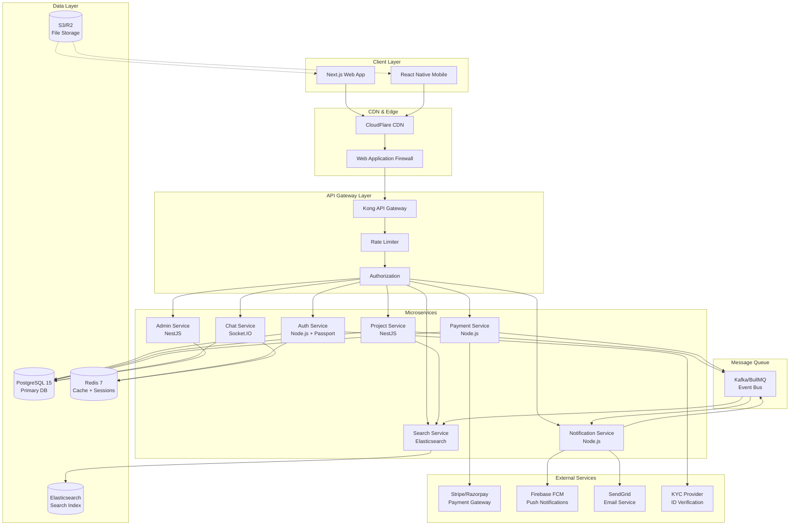
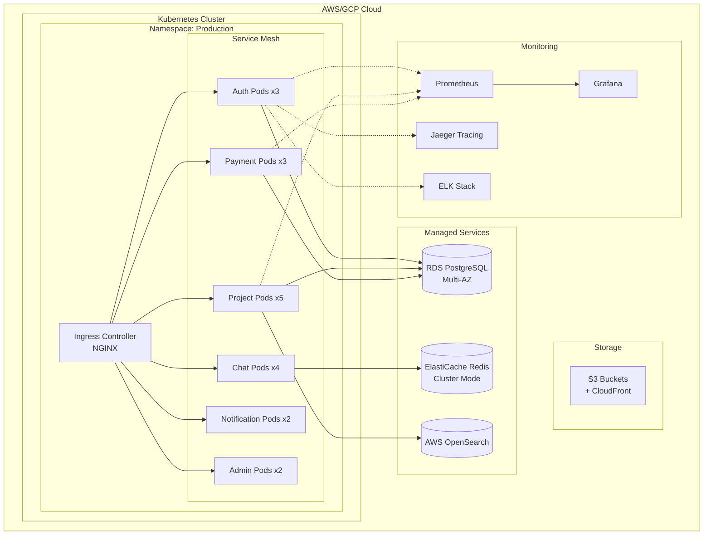
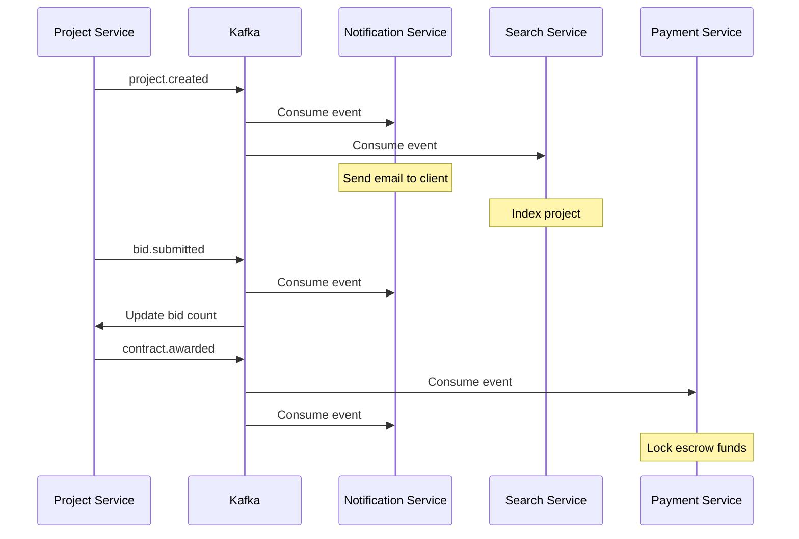
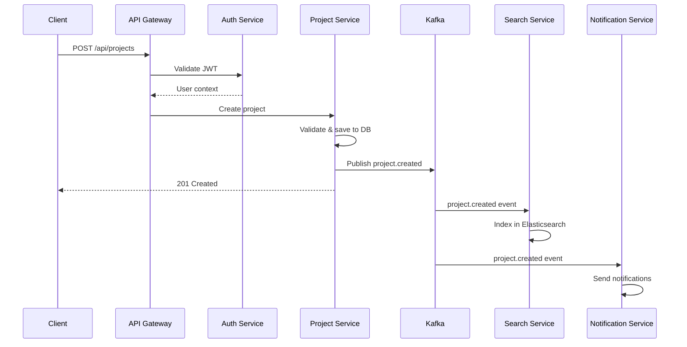
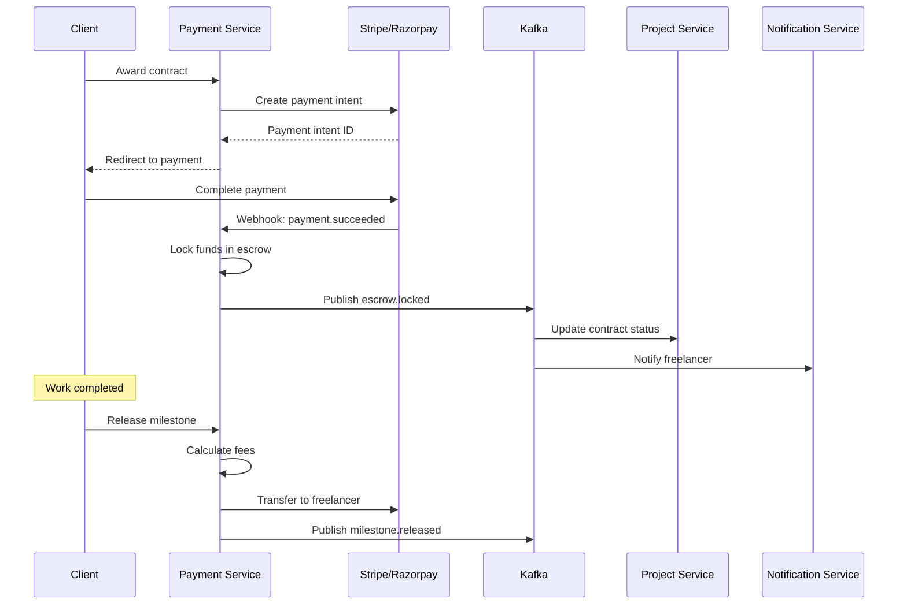
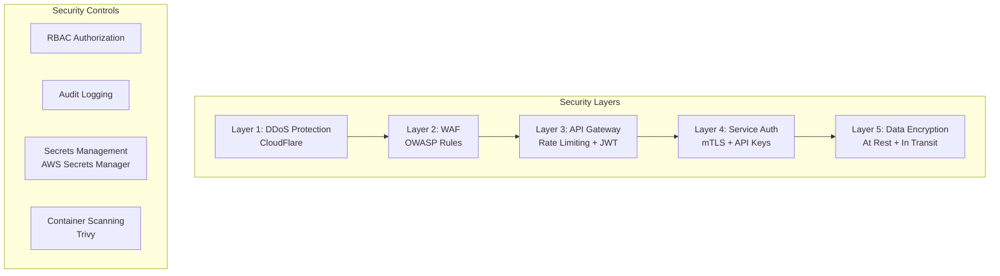
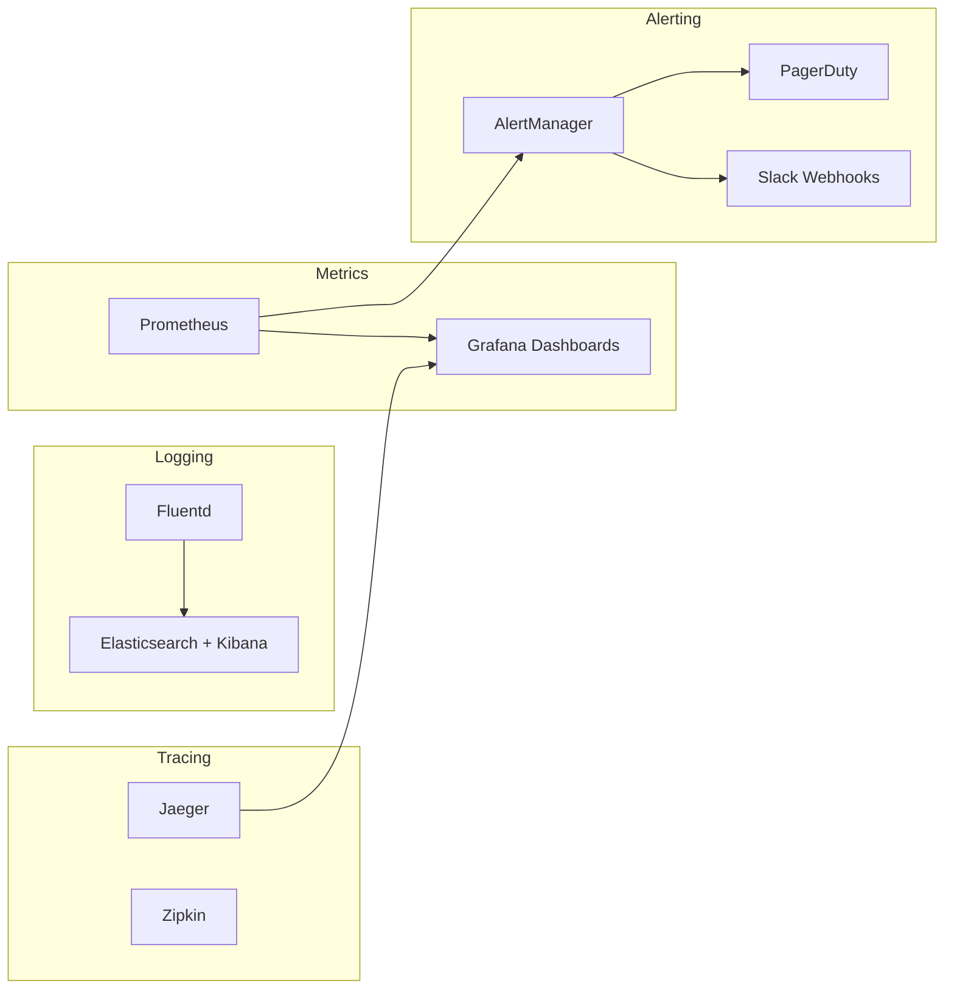

# Freelancer Platform - System Architecture

## 1. High-Level Architecture



## 2. Deployment Architecture



## 3. Service Communication Patterns

### 3.1 Synchronous Communication (REST)
- Client → API Gateway → Microservices
- Service-to-Service: Direct HTTP calls with circuit breakers
- Timeout: 5s default, 30s for payment operations

### 3.2 Asynchronous Communication (Kafka)



### 3.3 Real-time Communication (WebSocket)
- Chat Service: Socket.IO with Redis adapter for horizontal scaling
- Notification Service: Server-Sent Events (SSE) for live updates

## 4. Data Flow Patterns

### 4.1 Project Creation Flow



### 4.2 Payment & Escrow Flow



## 5. Security Architecture



### Security Measures
- **Authentication**: JWT with 15min access + 7d refresh tokens
- **Authorization**: Role-based access control (RBAC)
- **Data Encryption**: TLS 1.3 in transit, AES-256 at rest
- **PCI Compliance**: No card data stored, tokenization via Stripe
- **GDPR**: Data anonymization, right to deletion, audit logs
- **Rate Limiting**: 100 req/min per user, 1000 req/min per IP
- **Input Validation**: Joi/Zod schemas on all endpoints
- **SQL Injection**: Parameterized queries via Prisma ORM
- **XSS Protection**: Content Security Policy headers
- **CSRF**: SameSite cookies + CSRF tokens

## 6. Scalability Strategy

### 6.1 Horizontal Scaling
- All services stateless (session in Redis)
- Auto-scaling: CPU > 70% → add pods
- Load balancing: Round-robin with health checks

### 6.2 Database Scaling
- Read replicas for analytics queries
- Connection pooling (PgBouncer)
- Partitioning: Projects table by created_date (monthly)
- Archival: Move completed projects > 2 years to cold storage

### 6.3 Caching Strategy
```
L1: Browser cache (static assets)
L2: CDN cache (CloudFlare, 1 hour TTL)
L3: Redis cache (API responses, 5 min TTL)
L4: Database query cache
```

### 6.4 Performance Targets
- API Response Time: p95 < 200ms, p99 < 500ms
- Database Queries: < 50ms average
- WebSocket Latency: < 100ms
- File Upload: Support up to 50MB
- Concurrent Users: 10,000+ at launch
- Throughput: 5,000 requests/second

## 7. Monitoring & Observability



### Key Metrics to Monitor
- Request rate, error rate, duration (RED metrics)
- CPU, memory, disk usage per service
- Database connection pool utilization
- Kafka consumer lag
- Payment success/failure rates
- WebSocket connection count
- Cache hit ratio

## 8. Disaster Recovery

### 8.1 Backup Strategy
- Database: Automated daily backups, 30-day retention
- Point-in-time recovery: 5-minute granularity
- Cross-region replication for critical data

### 8.2 High Availability
- Multi-AZ deployment
- Database failover: < 60 seconds
- Service failover: Automatic via K8s
- RTO: 1 hour, RPO: 5 minutes

## 9. CI/CD Pipeline

```mermaid
graph LR
    DEV[Developer Push] --> GIT[GitHub]
    GIT --> ACTIONS[GitHub Actions]
    ACTIONS --> LINT[Lint + Format]
    LINT --> TEST[Unit Tests]
    TEST --> BUILD[Docker Build]
    BUILD --> SCAN[Security Scan]
    SCAN --> PUSH[Push to Registry]
    PUSH --> DEPLOY[Deploy to K8s]
    DEPLOY --> SMOKE[Smoke Tests]
    SMOKE --> PROD[Production]
```



### Pipeline Stages
1. Code quality: ESLint, Prettier
2. Testing: Jest (>70% coverage required)
3. Security: Trivy container scan, OWASP dependency check
4. Build: Multi-stage Docker builds
5. Deploy: Blue-green deployment strategy
6. Rollback: Automatic on health check failure
