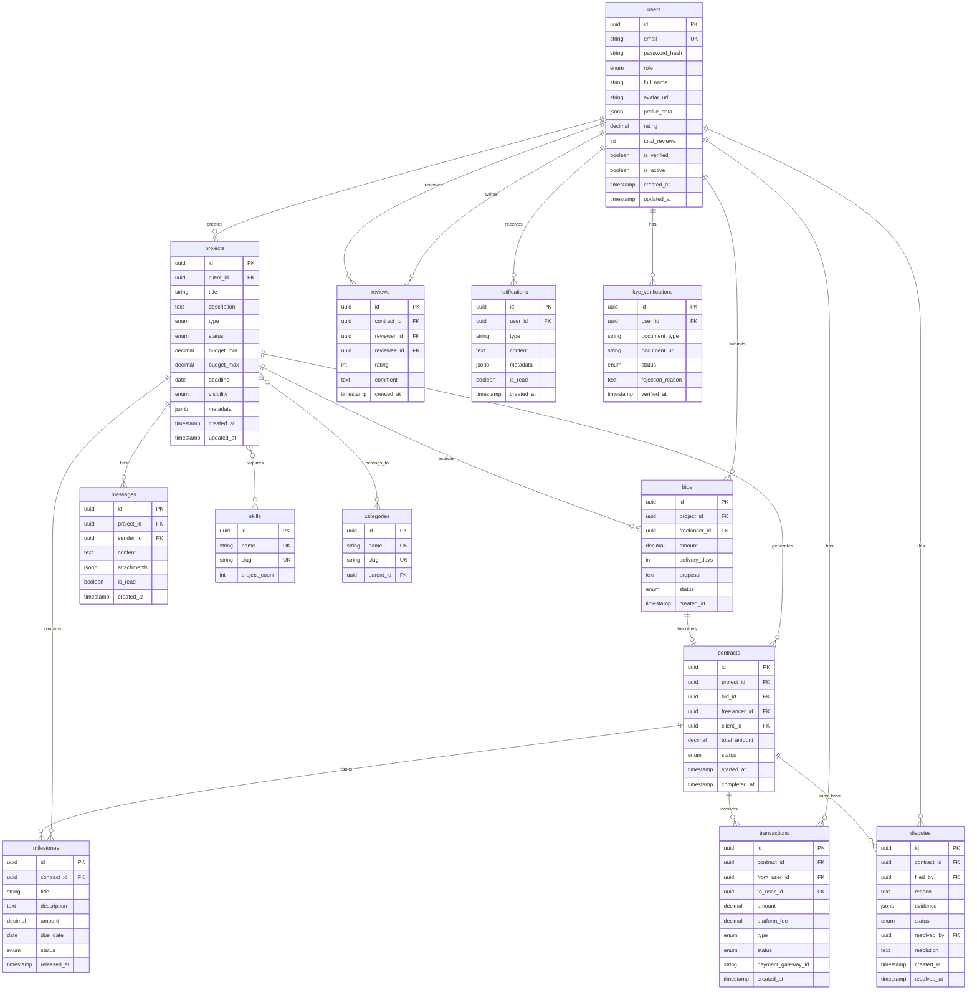

# Freelancer Platform - Database Schema & ERD

## Entity Relationship Diagram



## Detailed Schema Specifications

### Enums

```typescript
enum UserRole {
  FREELANCER = 'freelancer'
  CLIENT = 'client'
  ADMIN = 'admin'
}

enum ProjectType {
  FIXED_PRICE = 'fixed_price'
  HOURLY = 'hourly'
  CONTEST = 'contest'
}

enum ProjectStatus {
  DRAFT = 'draft'
  OPEN = 'open'
  IN_PROGRESS = 'in_progress'
  COMPLETED = 'completed'
  CANCELLED = 'cancelled'
}

enum ProjectVisibility {
  PUBLIC = 'public'
  INVITE_ONLY = 'invite_only'
  PRIVATE = 'private'
}

enum BidStatus {
  PENDING = 'pending'
  SHORTLISTED = 'shortlisted'
  ACCEPTED = 'accepted'
  REJECTED = 'rejected'
  WITHDRAWN = 'withdrawn'
}

enum ContractStatus {
  ACTIVE = 'active'
  COMPLETED = 'completed'
  CANCELLED = 'cancelled'
  DISPUTED = 'disputed'
}

enum MilestoneStatus {
  PENDING = 'pending'
  IN_PROGRESS = 'in_progress'
  SUBMITTED = 'submitted'
  APPROVED = 'approved'
  REJECTED = 'rejected'
}

enum TransactionType {
  ESCROW_LOCK = 'escrow_lock'
  MILESTONE_RELEASE = 'milestone_release'
  REFUND = 'refund'
  WITHDRAWAL = 'withdrawal'
}

enum TransactionStatus {
  PENDING = 'pending'
  COMPLETED = 'completed'
  FAILED = 'failed'
  REFUNDED = 'refunded'
}

enum DisputeStatus {
  OPEN = 'open'
  UNDER_REVIEW = 'under_review'
  RESOLVED = 'resolved'
  CLOSED = 'closed'
}

enum KYCStatus {
  PENDING = 'pending'
  APPROVED = 'approved'
  REJECTED = 'rejected'
}
```

### Indexes

```sql
-- Users
CREATE INDEX idx_users_email ON users(email);
CREATE INDEX idx_users_role ON users(role);
CREATE INDEX idx_users_rating ON users(rating DESC);
CREATE INDEX idx_users_created_at ON users(created_at DESC);

-- Projects
CREATE INDEX idx_projects_client_id ON projects(client_id);
CREATE INDEX idx_projects_status ON projects(status);
CREATE INDEX idx_projects_type ON projects(type);
CREATE INDEX idx_projects_created_at ON projects(created_at DESC);
CREATE INDEX idx_projects_budget ON projects(budget_min, budget_max);
CREATE INDEX idx_projects_deadline ON projects(deadline);

-- Bids
CREATE INDEX idx_bids_project_id ON bids(project_id);
CREATE INDEX idx_bids_freelancer_id ON bids(freelancer_id);
CREATE INDEX idx_bids_status ON bids(status);
CREATE INDEX idx_bids_amount ON bids(amount);

-- Contracts
CREATE INDEX idx_contracts_project_id ON contracts(project_id);
CREATE INDEX idx_contracts_freelancer_id ON contracts(freelancer_id);
CREATE INDEX idx_contracts_client_id ON contracts(client_id);
CREATE INDEX idx_contracts_status ON contracts(status);

-- Transactions
CREATE INDEX idx_transactions_contract_id ON transactions(contract_id);
CREATE INDEX idx_transactions_from_user_id ON transactions(from_user_id);
CREATE INDEX idx_transactions_to_user_id ON transactions(to_user_id);
CREATE INDEX idx_transactions_status ON transactions(status);
CREATE INDEX idx_transactions_created_at ON transactions(created_at DESC);

-- Messages
CREATE INDEX idx_messages_project_id ON messages(project_id);
CREATE INDEX idx_messages_sender_id ON messages(sender_id);
CREATE INDEX idx_messages_created_at ON messages(created_at DESC);

-- Notifications
CREATE INDEX idx_notifications_user_id ON notifications(user_id);
CREATE INDEX idx_notifications_is_read ON notifications(is_read);
CREATE INDEX idx_notifications_created_at ON notifications(created_at DESC);
```
