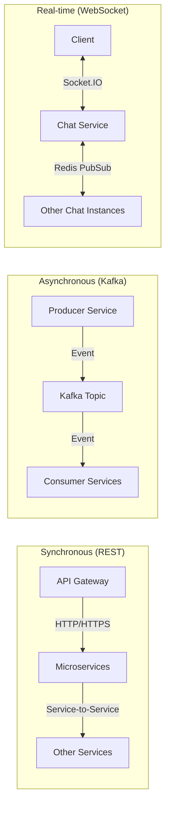
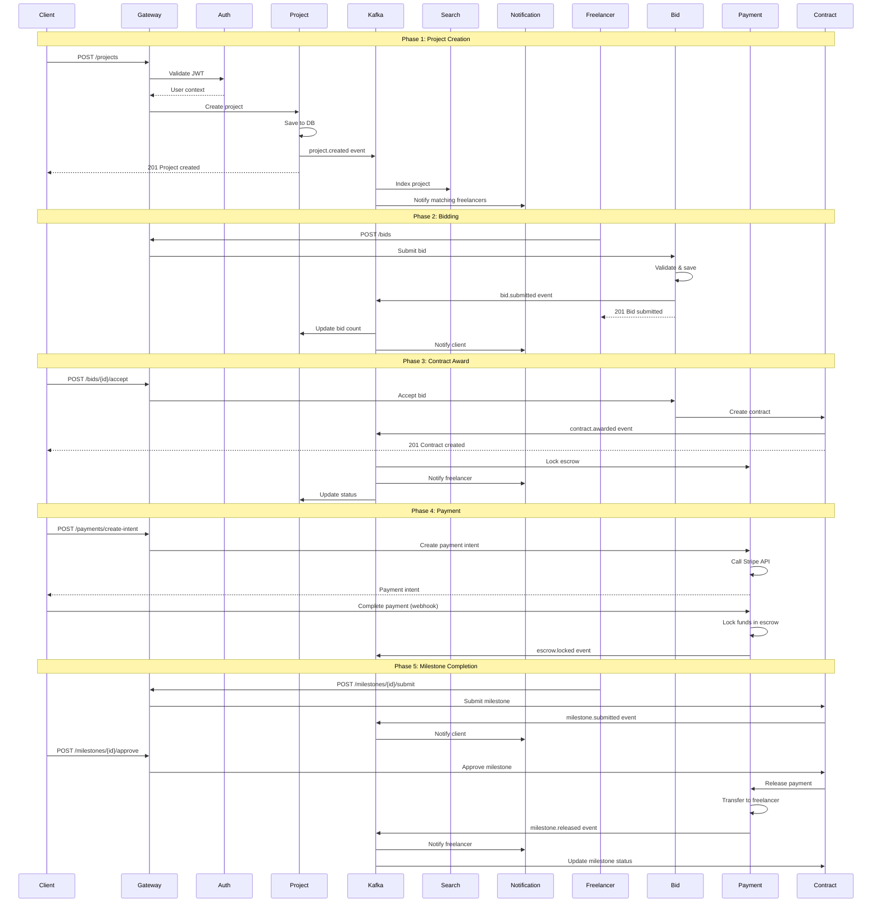
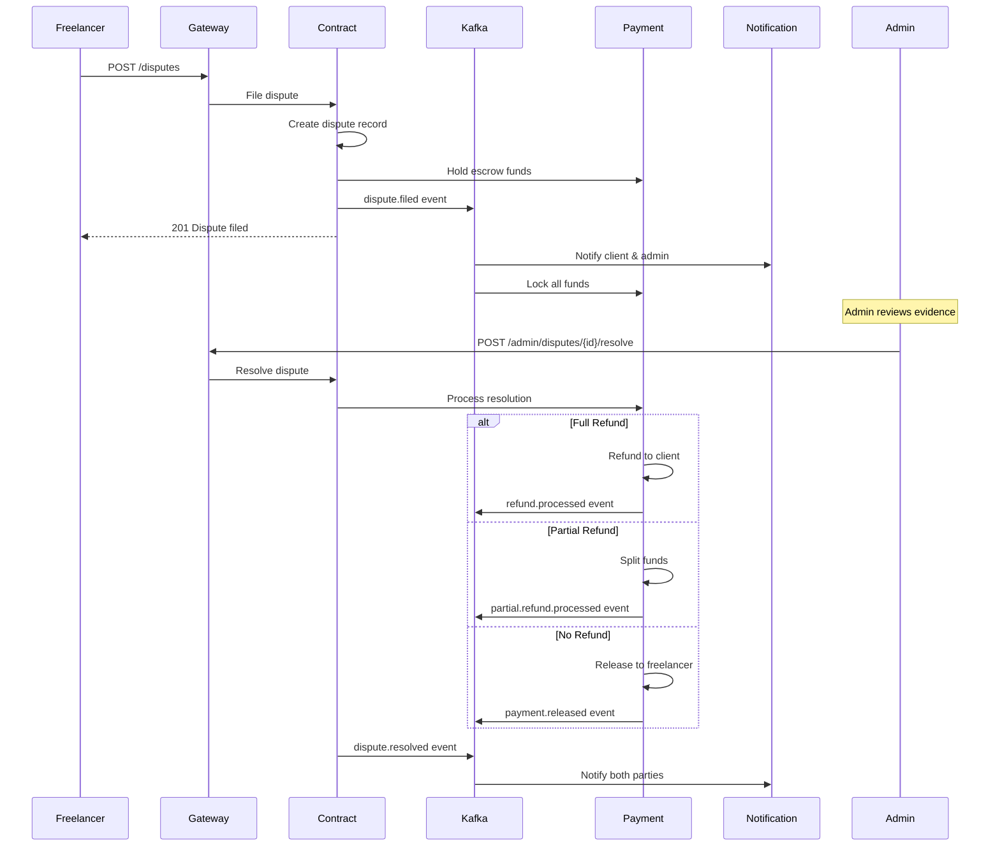
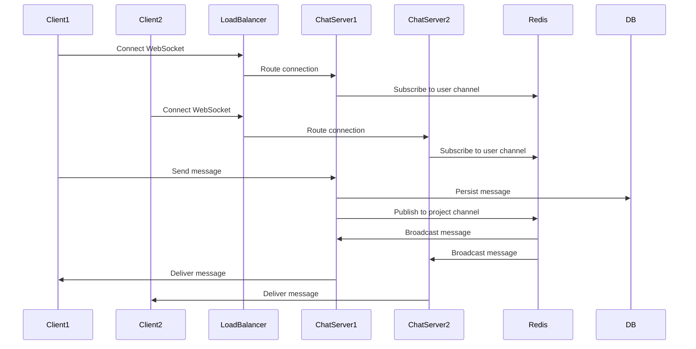
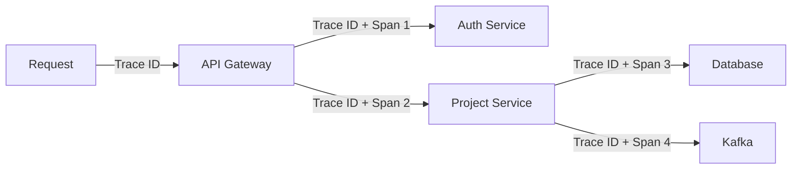
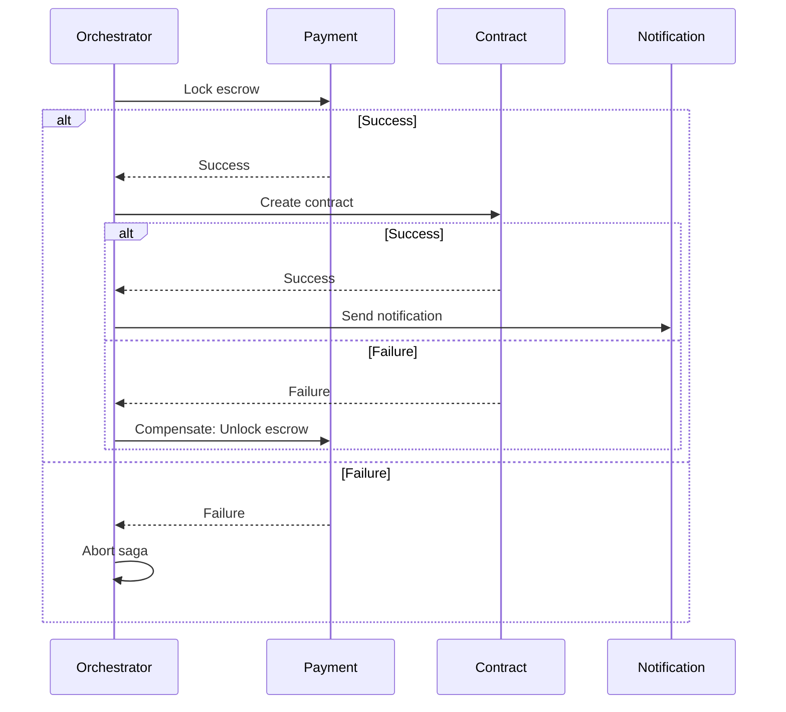

# Freelancer Platform - Microservices Communication Flow

## 1. Service Communication Overview

### Communication Patterns



## 2. Key User Flows

### 2.1 Complete Project Lifecycle Flow



### 2.2 Dispute Resolution Flow



### 2.3 Real-time Messaging Flow



## 3. Kafka Event Topics & Schemas

### 3.1 Topic Structure

```
freelancer-platform.{environment}.{domain}.{event}

Examples:
- freelancer-platform.prod.project.created
- freelancer-platform.prod.bid.submitted
- freelancer-platform.prod.payment.released
```

### 3.2 Event Schemas

#### project.created
```json
{
  "eventId": "uuid",
  "eventType": "project.created",
  "timestamp": "2026-03-26T10:00:00Z",
  "version": "1.0",
  "data": {
    "projectId": "uuid",
    "clientId": "uuid",
    "title": "string",
    "type": "FIXED_PRICE|HOURLY|CONTEST",
    "budgetMin": 1000,
    "budgetMax": 5000,
    "skills": ["uuid"],
    "categories": ["uuid"]
  }
}
```

#### bid.submitted
```json
{
  "eventId": "uuid",
  "eventType": "bid.submitted",
  "timestamp": "2026-03-26T10:00:00Z",
  "version": "1.0",
  "data": {
    "bidId": "uuid",
    "projectId": "uuid",
    "freelancerId": "uuid",
    "amount": 3000,
    "deliveryDays": 14
  }
}
```

#### contract.awarded
```json
{
  "eventId": "uuid",
  "eventType": "contract.awarded",
  "timestamp": "2026-03-26T10:00:00Z",
  "version": "1.0",
  "data": {
    "contractId": "uuid",
    "projectId": "uuid",
    "bidId": "uuid",
    "freelancerId": "uuid",
    "clientId": "uuid",
    "totalAmount": 3000,
    "milestones": [
      {
        "title": "Initial Design",
        "amount": 1000,
        "dueDate": "2026-04-10"
      }
    ]
  }
}
```

#### escrow.locked
```json
{
  "eventId": "uuid",
  "eventType": "escrow.locked",
  "timestamp": "2026-03-26T10:00:00Z",
  "version": "1.0",
  "data": {
    "transactionId": "uuid",
    "contractId": "uuid",
    "amount": 3000,
    "platformFee": 300,
    "paymentGatewayId": "pi_xxx"
  }
}
```

#### milestone.submitted
```json
{
  "eventId": "uuid",
  "eventType": "milestone.submitted",
  "timestamp": "2026-03-26T10:00:00Z",
  "version": "1.0",
  "data": {
    "milestoneId": "uuid",
    "contractId": "uuid",
    "freelancerId": "uuid",
    "deliverables": ["url1", "url2"]
  }
}
```

#### milestone.released
```json
{
  "eventId": "uuid",
  "eventType": "milestone.released",
  "timestamp": "2026-03-26T10:00:00Z",
  "version": "1.0",
  "data": {
    "milestoneId": "uuid",
    "contractId": "uuid",
    "transactionId": "uuid",
    "amount": 1000,
    "platformFee": 100,
    "freelancerId": "uuid"
  }
}
```

#### dispute.filed
```json
{
  "eventId": "uuid",
  "eventType": "dispute.filed",
  "timestamp": "2026-03-26T10:00:00Z",
  "version": "1.0",
  "data": {
    "disputeId": "uuid",
    "contractId": "uuid",
    "filedBy": "uuid",
    "reason": "string",
    "evidence": {}
  }
}
```

## 4. Service Dependencies Matrix

| Service | Depends On | Produces Events | Consumes Events |
|---------|-----------|-----------------|-----------------|
| Auth Service | PostgreSQL, Redis | user.registered, user.verified | - |
| Project Service | PostgreSQL, Kafka | project.created, project.updated | bid.submitted, contract.awarded |
| Bid Service | PostgreSQL, Kafka | bid.submitted, bid.accepted | project.created |
| Contract Service | PostgreSQL, Kafka | contract.awarded, milestone.submitted | bid.accepted, payment.completed |
| Payment Service | PostgreSQL, Stripe, Kafka | escrow.locked, milestone.released | contract.awarded, milestone.approved |
| Chat Service | Redis, PostgreSQL, Socket.IO | message.sent | - |
| Notification Service | FCM, SendGrid, Kafka | - | ALL events |
| Search Service | Elasticsearch, Kafka | - | project.created, project.updated |
| Admin Service | PostgreSQL | user.verified, dispute.resolved | dispute.filed |

## 5. Error Handling & Retry Strategies

### 5.1 Synchronous API Calls

```typescript
// Circuit Breaker Pattern
const circuitBreaker = {
  failureThreshold: 5,
  timeout: 5000,
  resetTimeout: 60000
};

// Retry with exponential backoff
const retryConfig = {
  maxRetries: 3,
  initialDelay: 1000,
  maxDelay: 10000,
  backoffMultiplier: 2
};
```

### 5.2 Kafka Event Processing

```typescript
// Dead Letter Queue (DLQ) configuration
const kafkaConsumerConfig = {
  groupId: 'notification-service',
  maxRetries: 3,
  retryDelay: 5000,
  dlqTopic: 'freelancer-platform.prod.dlq',
  enableIdempotency: true
};
```

### 5.3 Idempotency Keys

All state-changing operations use idempotency keys:

```http
POST /api/payments/create-intent
Idempotency-Key: uuid-v4
```

## 6. Service-to-Service Authentication

### 6.1 mTLS Configuration

```yaml
# Service mesh configuration
apiVersion: security.istio.io/v1beta1
kind: PeerAuthentication
metadata:
  name: default
spec:
  mtls:
    mode: STRICT
```

### 6.2 API Key Authentication

```typescript
// Internal service API key
headers: {
  'X-Service-Name': 'payment-service',
  'X-API-Key': process.env.INTERNAL_API_KEY,
  'X-Request-ID': uuid()
}
```

## 7. Rate Limiting Strategy

### 7.1 API Gateway Rate Limits

```yaml
# Kong rate limiting plugin
rate_limiting:
  minute: 100
  hour: 5000
  policy: redis
  fault_tolerant: true
  hide_client_headers: false
```

### 7.2 Service-Level Rate Limits

| Endpoint | Rate Limit | Burst |
|----------|-----------|-------|
| POST /auth/login | 5/min | 10 |
| POST /projects | 10/hour | 20 |
| POST /bids | 20/hour | 30 |
| POST /messages | 60/min | 100 |
| GET /projects | 100/min | 200 |

## 8. Monitoring & Tracing

### 8.1 Distributed Tracing



### 8.2 Key Metrics

```typescript
// Prometheus metrics
const metrics = {
  http_requests_total: Counter,
  http_request_duration_seconds: Histogram,
  kafka_messages_consumed_total: Counter,
  kafka_consumer_lag: Gauge,
  database_connection_pool_size: Gauge,
  cache_hit_ratio: Gauge
};
```

## 9. Data Consistency Patterns

### 9.1 Saga Pattern for Distributed Transactions



### 9.2 Event Sourcing for Audit Trail

```typescript
// Event store for critical operations
interface PaymentEvent {
  eventId: string;
  aggregateId: string; // contractId
  eventType: 'ESCROW_LOCKED' | 'MILESTONE_RELEASED' | 'REFUND_PROCESSED';
  timestamp: Date;
  data: any;
  metadata: {
    userId: string;
    ipAddress: string;
    userAgent: string;
  };
}
```

## 10. Service Health Checks

### 10.1 Health Check Endpoints

```typescript
// GET /health
{
  status: 'healthy' | 'degraded' | 'unhealthy',
  timestamp: '2026-03-26T10:00:00Z',
  checks: {
    database: { status: 'healthy', latency: 5 },
    redis: { status: 'healthy', latency: 2 },
    kafka: { status: 'healthy', lag: 0 }
  }
}
```

### 10.2 Readiness vs Liveness

```yaml
# Kubernetes probes
livenessProbe:
  httpGet:
    path: /health/live
    port: 3000
  initialDelaySeconds: 30
  periodSeconds: 10

readinessProbe:
  httpGet:
    path: /health/ready
    port: 3000
  initialDelaySeconds: 5
  periodSeconds: 5
```
